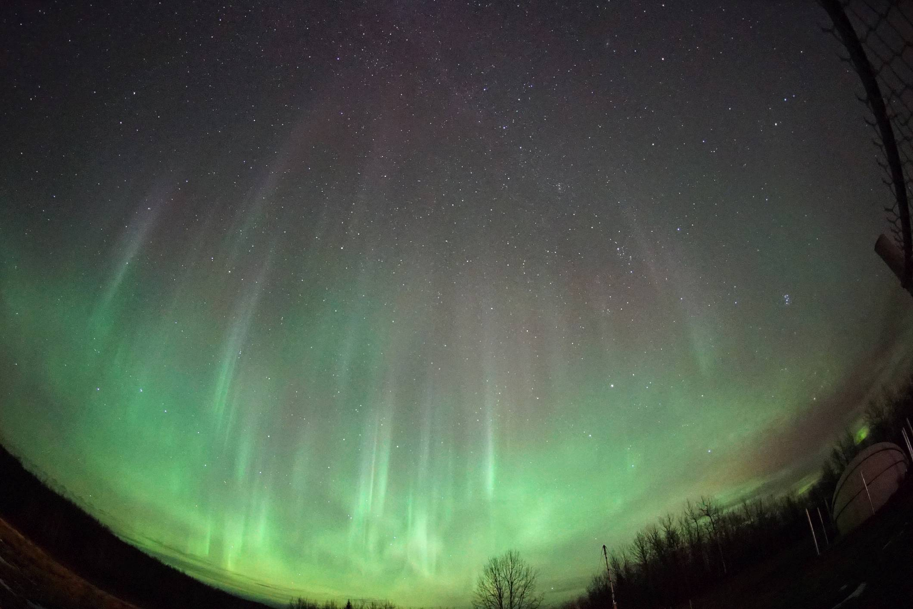
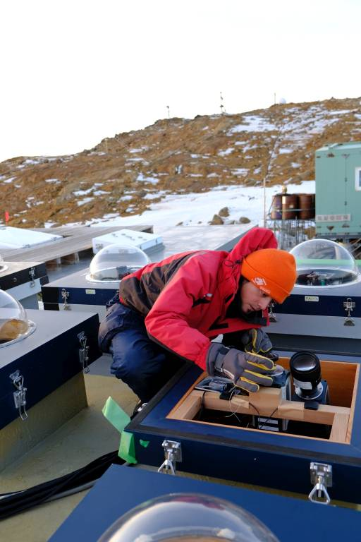

# はじめに

## 自己紹介

内田　ヘルベルト陽仁（あきひと）

- 国立極地研究所（立川）で、オーロラの研究をしています。
- アイスランドや南極へ観測に行ったり、観測データを分析したり、という仕事。
- ギター、電子楽器、電子工作が好き。

（左）オーロラ＠カナダ・アサバスカ、（右）観測用のカメラを設置中＠南極・昭和基地

## 授業の進め方

- オンデマンド型の授業

- 次回の授業のWebテキストを、週の前半にアップ

- テキストに沿って、各自で進める

- 分からない事があったら、授業の時間中は、Teamsの掲示板／個人のチャットで聞いてください
  （授業時間以外であれば、土曜日中であれば出来る限り早く返事をします）

- Webテキストの最後に課題、期限は２週間後の授業日まで
  （今回は初回なので、課題は無し）

